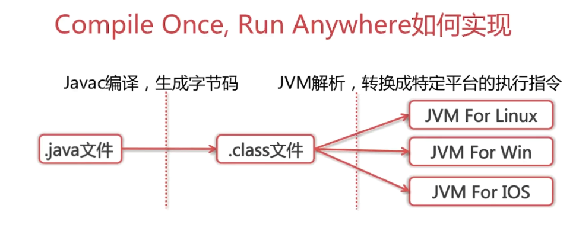
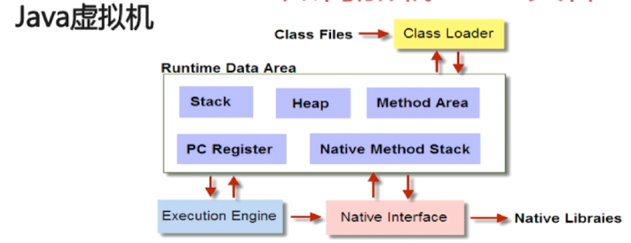

## 6-1 谈谈你对Java的理解
- 平台无关性：一次编译，到处运行
- GC：垃圾回收机制
- 语言特性：泛型、反射、lamuda表达式表达式
- 面向对象：封装、继承、多态
- 类库：集合、并发、网络、IO/NIO
- 异常处理

## 6-2 平台无关性如何实现
- 编译时  
使用javac指令，将源码编译生成字节码，并存入到对应的.class文件中。  
```java
package javabasic;

public class ByteCodeSample {
    public static void main(String[] args) {
        int i = 1, j = 5;
        i++;
        ++j;
        System.out.println(i);
        System.out.println(j);
    }
}
```  
使用javac ByteCodeSample.java 编译生成ByteCodeSample.class文件，使用javap -c ByteCodeSample.class对字节码进行反汇编，查看字节码内容。
```java
Compiled from "ByteCodeSample.java"
public class javabasic.ByteCodeSample {
  public javabasic.ByteCodeSample();
    Code:
       0: aload_0
       1: invokespecial #1                  // Method java/lang/Object."<init>":()V
       4: return

  public static void main(java.lang.String[]);
    Code:
       0: iconst_1                          //将常量1放到栈顶
       1: istore_1                          //将栈顶的值放到局部变量1中
       2: iconst_5                          //将常量2放到栈顶
       3: istore_2                          //将栈顶的值放到局部变量2中
       4: iinc          1, 1                //将变量1加1
       7: iinc          2, 1                //将变量2加1
      10: getstatic     #2                  // Field java/lang/System.out:Ljava/io/PrintStream;
      13: iload_1
      14: invokevirtual #3                  // Method java/io/PrintStream.println:(I)V
      17: getstatic     #2                  // Field java/lang/System.out:Ljava/io/PrintStream;
      20: iload_2
      21: invokevirtual #3                  // Method java/io/PrintStream.println:(I)V
      24: return
}
```  
  
- 运行时  
.class文件是跨平台的基础，Java源码首先被编译成字节码，再由不同平台的JVM进行解析，
Java语言在不同的平台运行时不需要重新进行编译，Java虚拟机在执行字节码的时候，把字节码解释成具体平台上的机器指令。
> Q：为什么JVM不直接将源码解析成机器码去执行  

> A：每次执行的时候都需要进行各种语法、句法、语义的检查，即每次执行的时候这些分析的结果都不会保存下来，
  要重新进行编译，重新去分析，这样整体的性能就会受到影响。同时，也可以脱离Java的束缚，将别的语言解析成字节码，同样能被JVM执行。


## 6-3 JVM如何加载.class文件
  
- Class Loader ：依据特定格式，加载class文件到内存
- Execution Engine ：对命令进行解析
- Native Interface : 融合不同开发语言的原生库为Java所用
- Runtime Date Area : JVM内存空间结构模型

## 6-4 什么是反射
Java反射机制是在运行状态中，对于任意一个类，都能够知道这个类的所有属性和方法；对于任意一个对象，都能够调用它的任意方法和
属性；这种动态获取信息以及动态调用对象方法的功能成为Java语言的反射机制。  
要想理解反射的原理，首先要了解什么是类型信息。Java让我们在运行时识别对象和类的信息，主要有2种方式：一种是传统的RTTI，
它假定我们在编译时已经知道了所有的类型信息；另一种是反射机制，它允许我们在运行时发现和使用类的信息。
- 得到Class对象的三种方式
```java
//1、通过对象调用 getClass() 方法来获取,通常应用在：比如你传过来一个 Object
//  类型的对象，而我不知道你具体是什么类，用这种方法
　　Person p1 = new Person();
　　Class c1 = p1.getClass();
        
//2、直接通过 类名.class 的方式得到,该方法最为安全可靠，程序性能更高
//  这说明任何一个类都有一个隐含的静态成员变量 class
　　Class c2 = Person.class;
        
//3、通过 Class 对象的 forName() 静态方法来获取，用的最多，
//   但可能抛出 ClassNotFoundException 异常
　　Class c3 = Class.forName("com.ys.reflex.Person");
```
**需要注意的是：一个类在 JVM 中只会有一个 Class 实例,即我们对上面获取的 c1,c2,c3进行 equals 比较，发现都是true。**

- 通过Class类获取成员变量、成员方法、接口、超类、构造方法等
```java
getName();//获取类的完整名字
getFields();//获取类的public类型的属性，包括继承过来的。
getDeclaredFields();//获取类的所有属性。包括private声明的属性。但不包括继承过来的属性。
getMethods();//获得类的public类型的方法。包括继承过来的。
getDeclaredMethods();//获得类的所有方法。包括private 声明的。不包括继承过来的方法。
getMethod(String name, Class[] parameterTypes);//获得类的特定方法，name参数指定方法的名字，parameterTypes 参数指定方法的参数类型。
getConstructors();//获得类的public类型的构造方法。
getConstructor(Class[] parameterTypes);//获得类的特定构造方法，parameterTypes 参数指定构造方法的参数类型。
newInstance();//通过类的不带参数的构造方法创建这个类的一个对象。
```
例子：  
```java
//获得类完整的名字
String className = c2.getName();
System.out.println(className);//输出com.ys.reflex.Person
        
//获得类的public类型的属性。
Field[] fields = c2.getFields();
for(Field field : fields){
   System.out.println(field.getName());//age
}
        
//获得类的所有属性。包括私有的
Field [] allFields = c2.getDeclaredFields();
for(Field field : allFields){
    System.out.println(field.getName());//name    age
}
        
//获得类的public类型的方法。这里包括 Object 类的一些方法
Method [] methods = c2.getMethods();
for(Method method : methods){
    System.out.println(method.getName());//work waid equls toString hashCode等
}
        
//获得类的所有方法。
Method [] allMethods = c2.getDeclaredMethods();
for(Method method : allMethods){
    System.out.println(method.getName());//work say
}
        
//获得指定的属性
Field f1 = c2.getField("age");
System.out.println(f1);
//获得指定的私有属性
Field f2 = c2.getDeclaredField("name");
//启用和禁用访问安全检查的开关，值为 true，则表示反射的对象在使用时应该取消 java 语言的访问检查；反之不取消
f2.setAccessible(true);
System.out.println(f2);
                
//创建这个类的一个对象
Object p2 =  c2.newInstance();
//将 p2 对象的  f2 属性赋值为 Bob，f2 属性即为 私有属性 name
f2.set(p2,"Bob");
//使用反射机制可以打破封装性，导致了java对象的属性不安全。 
System.out.println(f2.get(p2)); //Bob
        
//获取构造方法
Constructor [] constructors = c2.getConstructors();
for(Constructor constructor : constructors){
    System.out.println(constructor.toString());//public com.ys.reflex.Person()
}
```
-  根据反射获取父类属性  
父类：Parent.java
```java
public class Parent {
    public String publicField = "parent_publicField";
    protected String protectField = "parent_protectField";
    String defaultField = "parent_defaultField";
    private String privateField = "parent_privateField";

}
```
子类：Son.java
```java
public class Son extends Parent {
}
```
测试类：
```java
public class ReflectionTest {

    @Test
    public void testGetParentField() throws Exception{
        Class c1 = Class.forName("com.ys.model.Son");
        //获取父类私有属性值
        System.out.println(getFieldValue(c1.newInstance(),"privateField"));
    }

    public static Field getDeclaredField(Object obj,String fieldName) {
        Field field = null;
        Class c = obj.getClass();
        for(; c != Object.class ; c = c.getSuperclass()){
            try {
                field = c.getDeclaredField(fieldName);
                field.setAccessible(true);
                return field;
            }catch (Exception e){
                //这里甚么都不要做！并且这里的异常必须这样写，不能抛出去。
                //如果这里的异常打印或者往外抛，则就不会执行c = c.getSuperclass(),最后就不会进入到父类中了
            }
        }
        return null;
    }
    public static Object getFieldValue(Object object,String fieldName) throws Exception{
        Field field = getDeclaredField(object,fieldName);

        return field.get(object);
    }
}
```
**通过执行上述代码，我们获得了父类的私有属性值，这里要注意的是直接通过反射获取子类的对象是不能得到父类的属性值的，
必须根据反射获得的子类 Class 对象在调用  getSuperclass() 方法获取父类对象，然后在通过父类对象去获取父类的属性值。**

